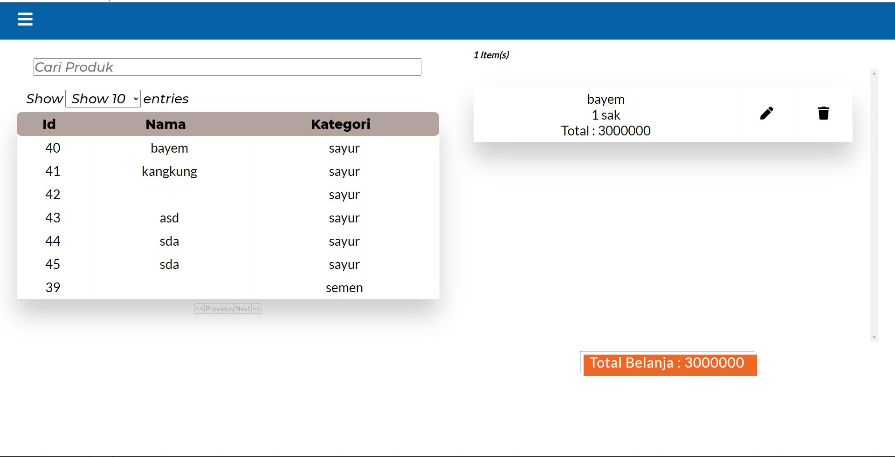
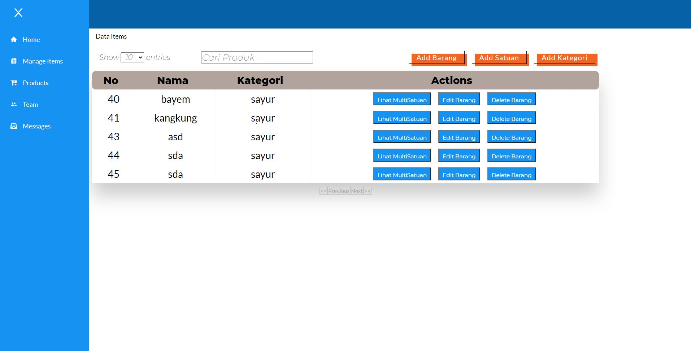
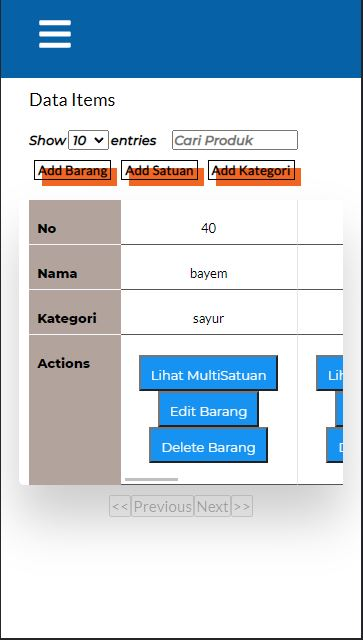
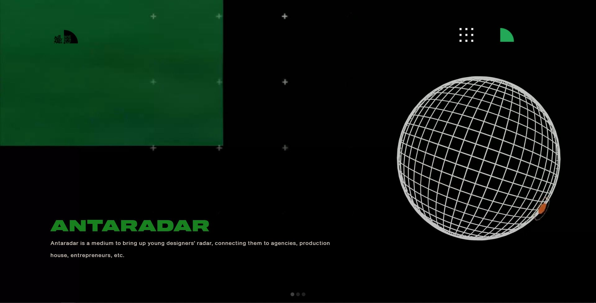
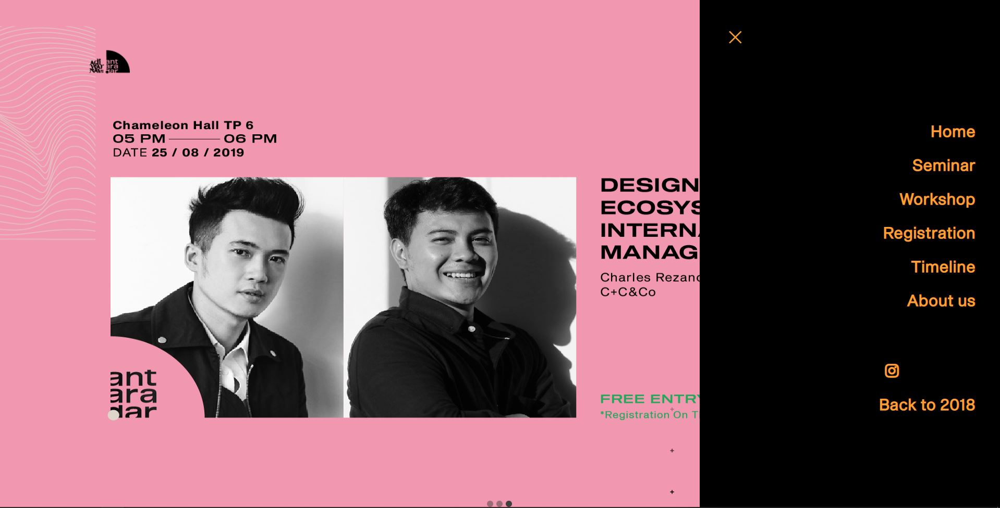
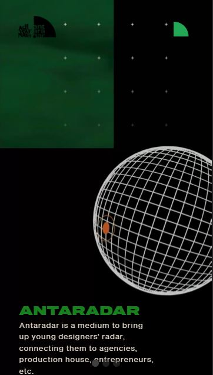
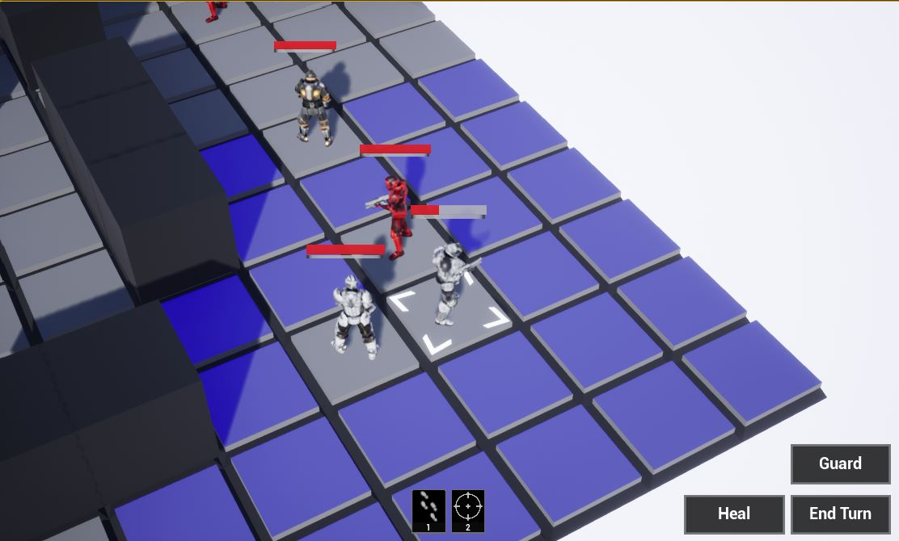
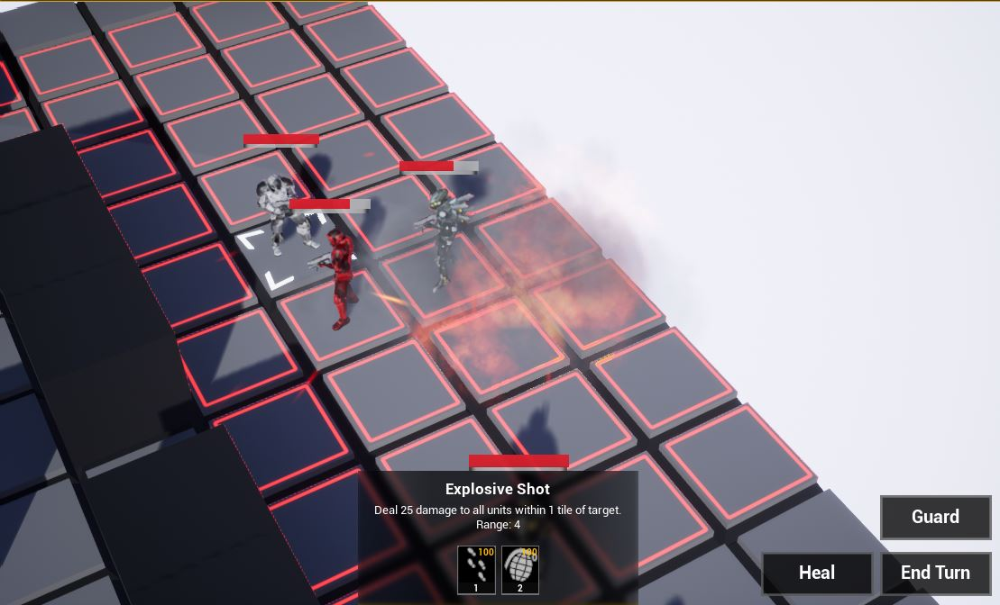

# Portfolio
All about the things that I've worked on.

# Cashier App
It is a small project that I made with my 2 other friends to learn how to make a website with ReactJS as front-end framework and Node and Express server as an API. My role is specifically to made an inventory management of the app, that consists of item list, adding item, adding the unit of the item, actions of the item such as edit (stock, price, name), and delete. 

   
   
   

# Adiwarna Antaradar
Adiwarna Antaradar is a volunteer work that I did with my other friend when I was a student on Universitas Kristen Petra to make a website about the event. The event is pretty much an exhibition about the result of the final thesis of Petra's students that majoring in visual communication design. The event also has workshop that taught you how to make an embroidery totebag and using various paper for crafts. My specific role in this work is to make a main page and navbar for the website. I made this using bootstrap.  
Website link : https://adiwarna.petra.ac.id/2019/ 

   
   
   

# AI Goal-Oriented Action Planning
AI GOAP is a project that I made for final thesis using Unreal Engine 4. In this thesis, I tried to implement Goal-Oriented Action Planning method to make the AI more adaptive, especially on Turn-based game. The result are, AI GOAP has better result based on how realistic AI's movement are, and level of palyer satisfaction. But in terms of difficulty based on player's opinion, AI with Finite-State Machine is harder than AI GOAP, mostly because the resources that AI FSM has is more than AI GOAP's. 

   
   

