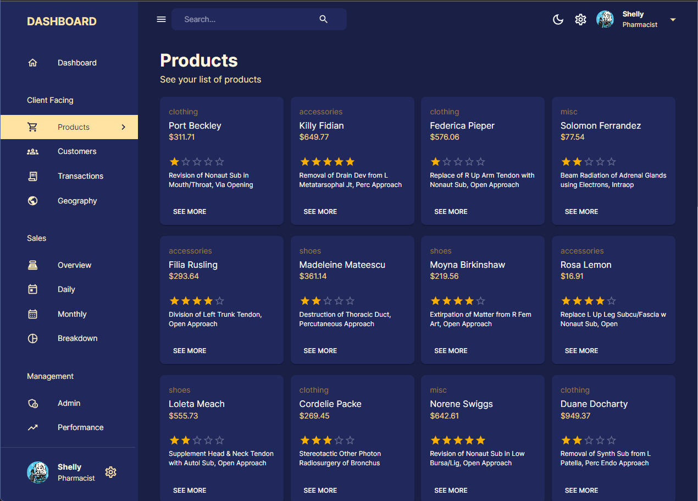
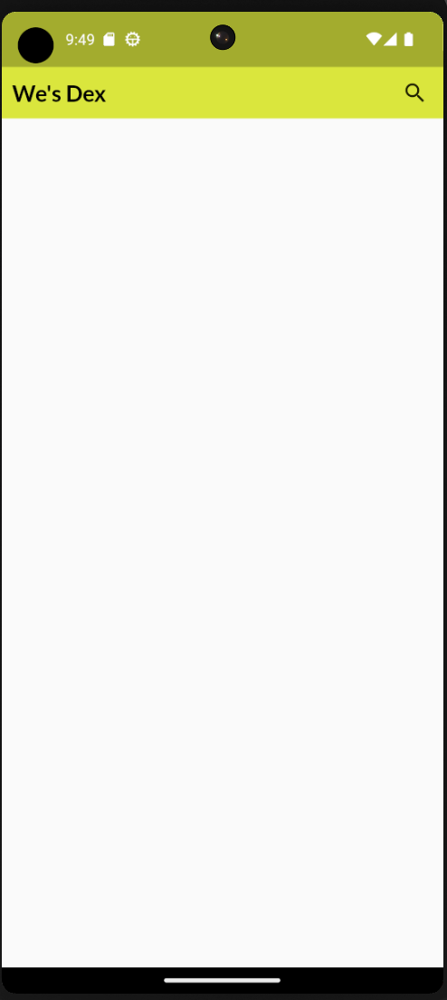
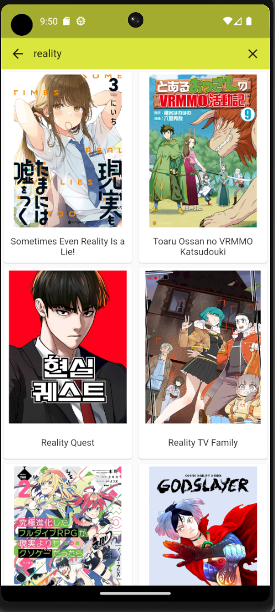
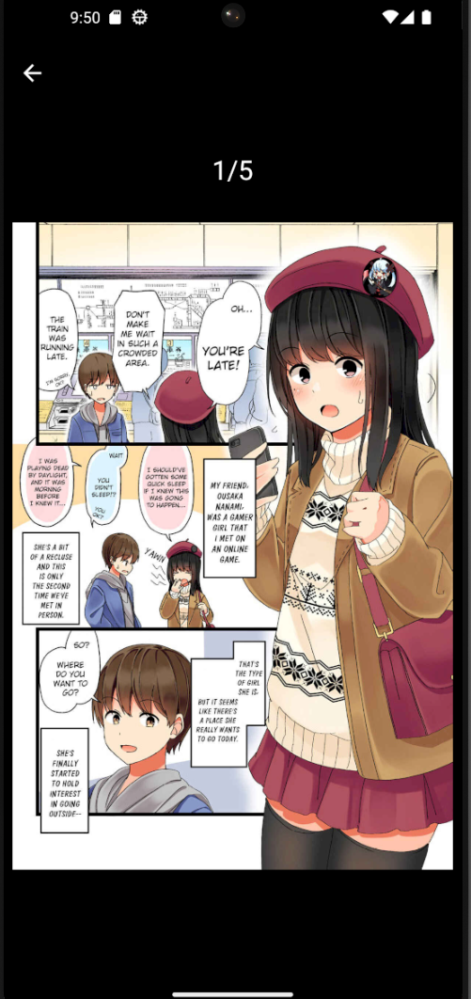
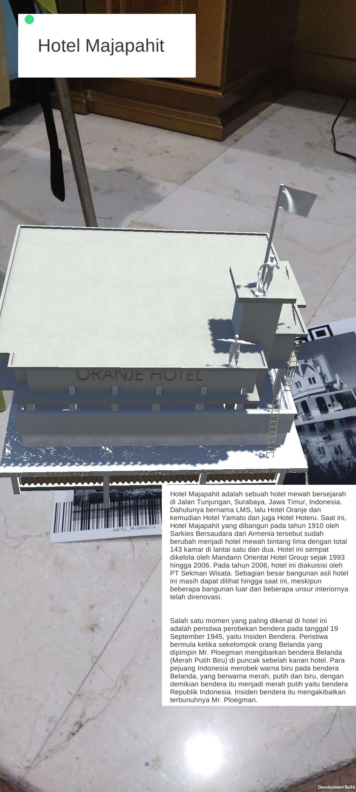
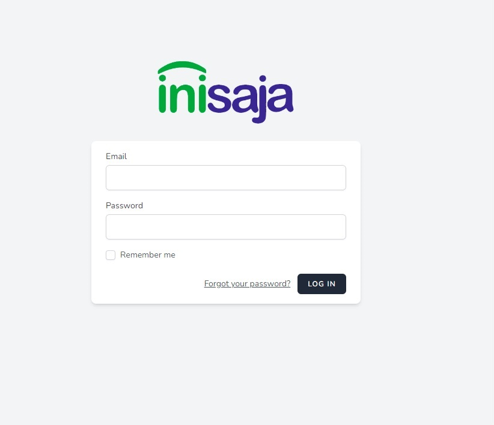
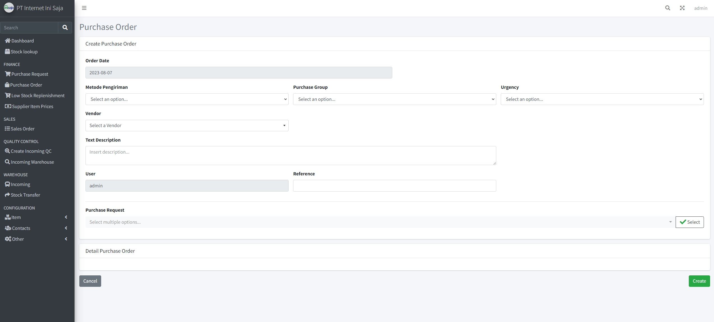
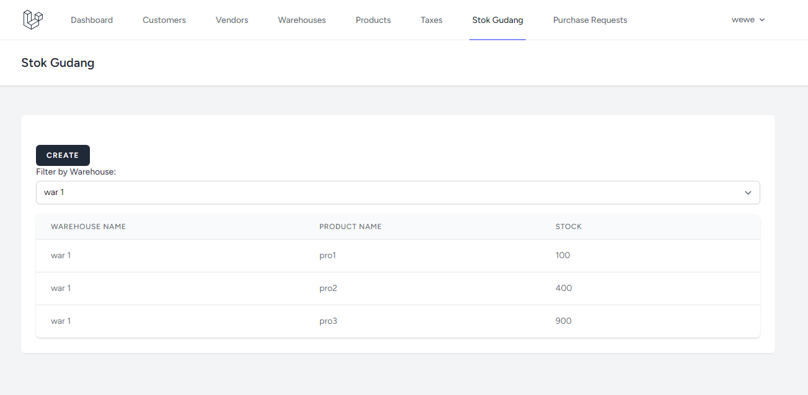
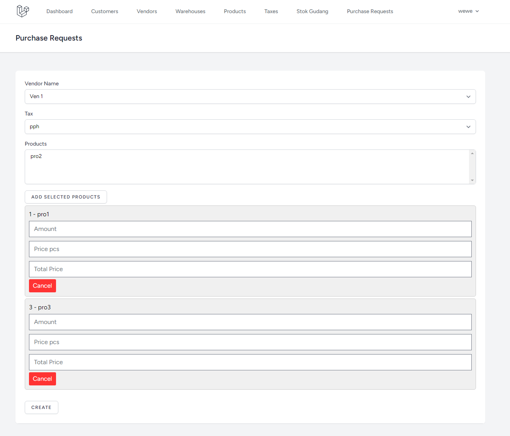

# Portfolio
All about the things that I've worked on in my free time.

Business Inquiries : w.rookie3ryan@gmail.com

# Personal / Learning Projects
# React Dashboard
React dashboard is a study by myself to make a dashboard using React and NodeJS. For front-end, I used Material UI and Redux Toolkits, while the back-end used Express, Mongoose, and MongoDB. My objective is to learn how to make a website using react and fetch the APIs using NodeJS.
repository : https://github.com/ryanchandrakusuma/react-admin

   
   

# We's MD 
We's MD is an app to read manga with reference from an app named Tachiyomi. I used Flutter and fetch the API straight from the Mangadex itself to make the app. I made this app for personal use, and I'm planning to put it to google play as a free app for everyone to use. My personal objective making this app is to re-learn how to make an app using Flutter and how to use the state management properly.  
App link (debug version) : https://drive.google.com/drive/folders/1X44h6Z0WogdVmqDh81mM4a63jVsMkuMS?usp=sharing

  
   
  
   

# Freelance (Used/Published Projects)
# Adiwarna Antaradar
Adiwarna Antaradar is a volunteer work that I did with my other friends when I was a student on Universitas Kristen Petra to make a website about the event. The event is pretty much an exhibition about the result of the final thesis of Petra's students that majoring in visual communication design. The event also has workshop that taught you how to make an embroidery totebag and using various paper for crafts. My specific role in this work is to make a main page and navbar for the website. I made this using bootstrap.  
Website link : https://adiwarna.petra.ac.id/2019/ 

   
   
   

# AI Goal-Oriented Action Planning
AI GOAP is a project that I made for final thesis using Unreal Engine 4. In this thesis, I tried to implement Goal-Oriented Action Planning method to make the AI more adaptive, especially on Turn-based game. The result are, AI GOAP has better result based on how realistic AI's movement are, and level of palyer satisfaction. But in terms of difficulty based on player's opinion, AI with Finite-State Machine is harder than AI GOAP, mostly because the resources that AI FSM has are more than AI GOAP's.
Github Link : https://github.com/ryanchandrakusuma/skripsi1
 

   
   

# AYOREK
AYOREK is an Augmented Reality App that is intended for students to know Hotel Majapahit Surabaya's history. I worked as a team with other artists to make an app for their thesis using Unity and Vuforia. My specific role is to develop the application based on the thesis' objective and assets.
 

   

# Warehouse Management
Warehouse Management is a website to handle inventory management (almost like ERP) for NusaNet, such as stock transfer between warehouses, incoming items to warehouse, qc items in warehouses, purchase order, sales order, etc. I worked with other 2 collaborators, and used Laravel 9, Laravel Breeze for authentication, and AdminLTE for its dashboard templates. 
 

   
   

# Simple CRUD Laravel
I made this project to make my own template for simple interview / project assignment. I'm using Laravel Breeze for its authentication and dashboard. For extra layer development, I'm using Repository pattern to interact with databases directly and bridge it between models and controllers to make development cleaner and easier in mind. To make it better, you can implement AdminLTE template to your liking to make the dashboard and content better feature-wise. repository : https://github.com/ryanchandrakusuma/simple-crud-laravel

   
   

